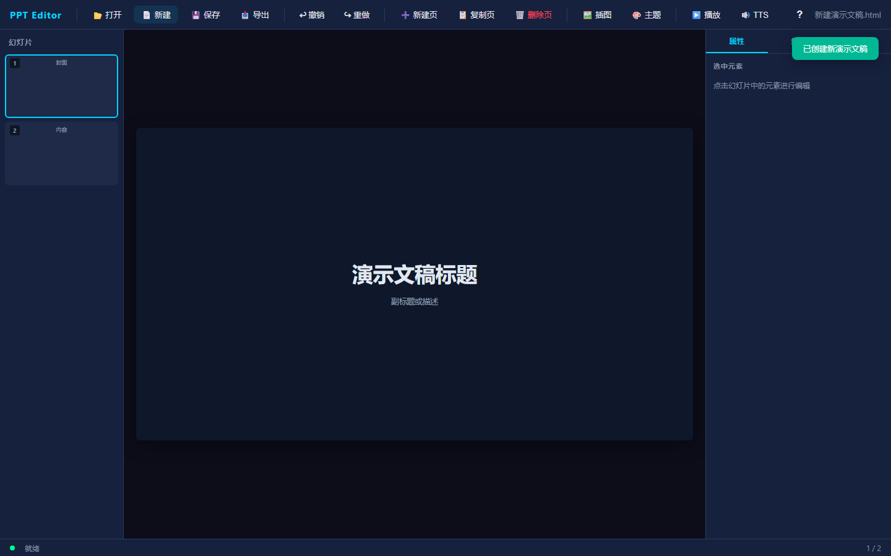
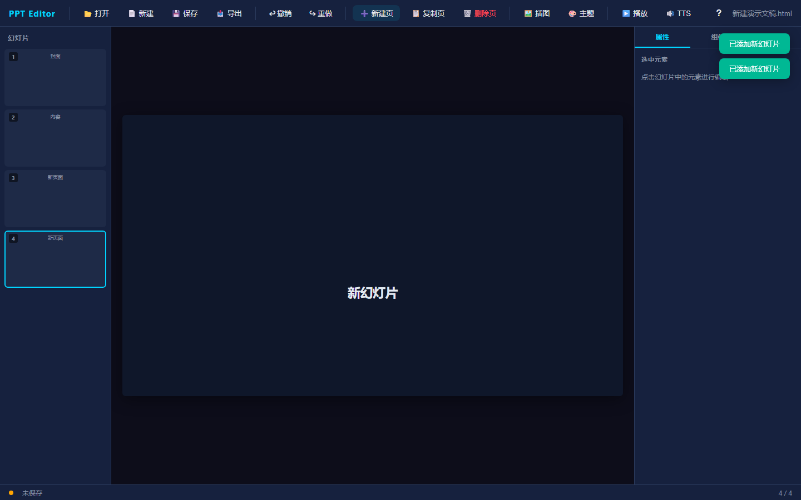
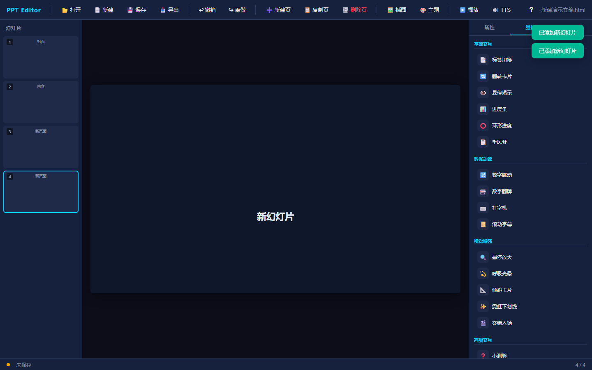
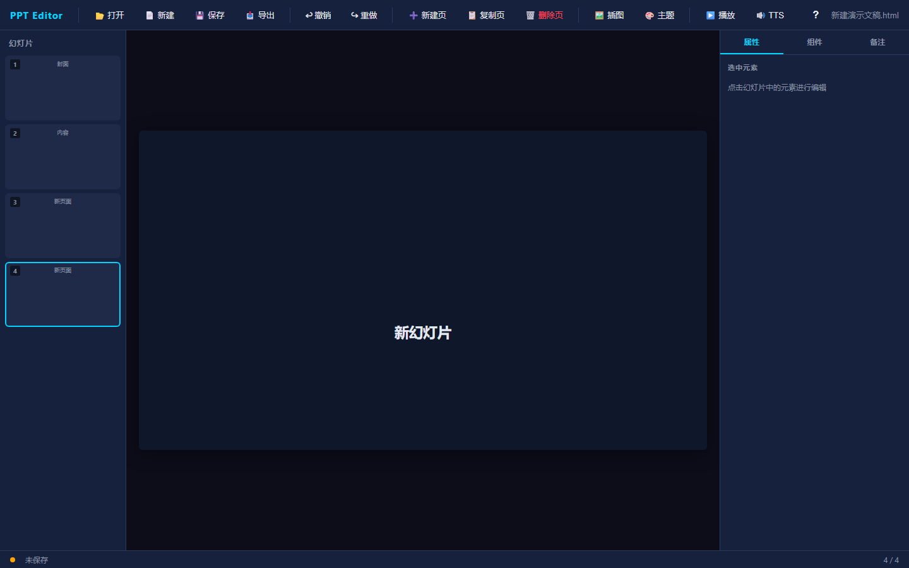
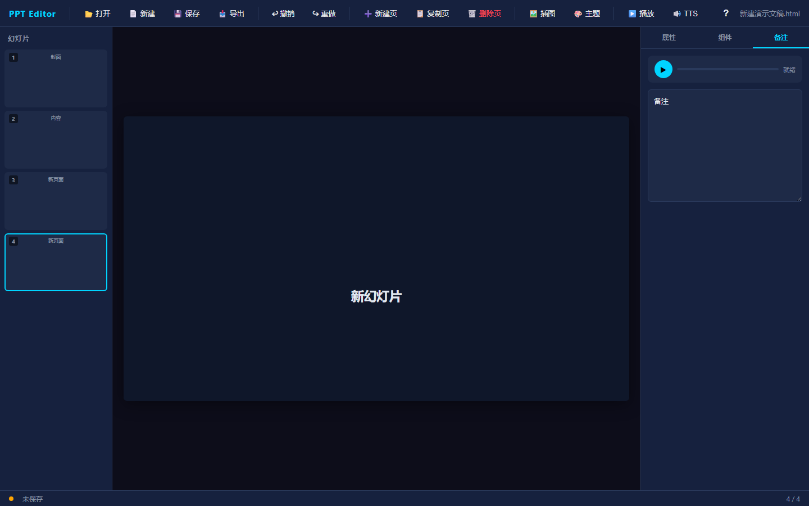
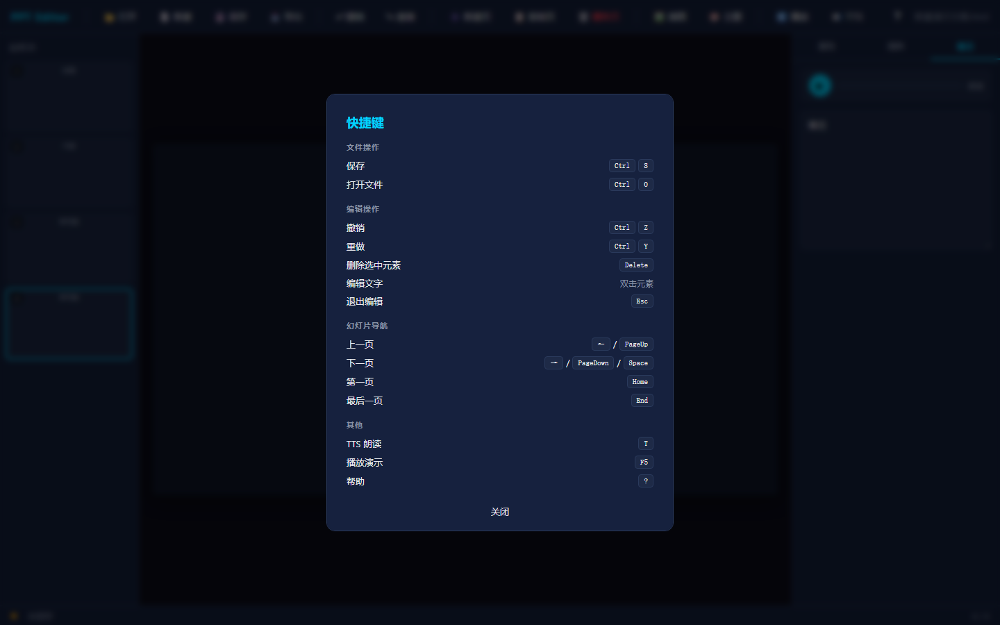

# HTML PPT Editor

一个功能丰富的可视化 HTML PPT 编辑器，支持在线编辑、实时预览、组件拖放、TTS 语音朗读等功能。



## 功能特性

### 核心编辑功能

- **可视化编辑** — 直接在预览区点击选中元素，实时修改样式
- **文字编辑** — 双击元素进入编辑模式，支持光标定位
- **撤销/重做** — Ctrl+Z 撤销，Ctrl+Y / Ctrl+Shift+Z 重做
- **元素拖拽** — 选中元素后拖动移动手柄调整位置
- **图片调整** — 支持拖拽调整图片大小

### 幻灯片管理

- **新建幻灯片** — 快速添加空白页面
- **复制幻灯片** — 一键复制当前页面
- **删除幻灯片** — 带确认对话框，防止误删
- **拖拽排序** — 左侧缩略图支持拖拽调整顺序
- **幻灯片导航** — 点击缩略图快速切换



### 丰富的交互组件

内置 20+ 交互组件，一键插入：

| 类别 | 组件 |
|------|------|
| **基础交互** | 标签切换、翻转卡片、悬停揭示、进度条、环形进度、手风琴 |
| **数据动效** | 数字跳动、数字翻牌、打字机、滚动字幕 |
| **视觉增强** | 悬停放大、呼吸光晕、倾斜卡片、霓虹下划线、交错入场 |
| **高级交互** | 小测验、轮播、步进器、开关切换、拖拽排序 |



### 属性面板

选中元素后，右侧面板实时显示可编辑属性：

- **字号** — 滑块调整，8px ~ 72px
- **颜色** — 颜色选择器 + HEX 值显示
- **字体粗细** — 下拉选择 100-900
- **文本对齐** — 左/居中/右对齐按钮组
- **组件属性** — 根据组件类型显示专属配置



### 备注与 TTS

- **演讲者备注** — 每页独立备注，右侧编辑
- **TTS 语音朗读** — 基于 Web Speech API，支持中英文
- **朗读进度条** — 实时显示朗读进度



### 文件操作

- **原生文件选择** — 支持 File System Access API，可打开电脑任意位置的 HTML 文件
- **文件拖放** — 直接拖放 .html 文件或图片到编辑器
- **保存** — Ctrl+S 快捷保存，支持自动备份
- **导出** — 一键导出为独立 HTML 文件
- **新建** — 快速创建空白演示文稿
- **最近文件** — 记录最近打开的 10 个文件

### 其他功能

- **主题切换** — 一键切换深色/浅色模式
- **自动保存** — 每 30 秒自动保存（需先打开文件）
- **Toast 通知** — 操作结果实时反馈
- **Loading 遮罩** — 文件加载/保存时显示加载状态
- **确认对话框** — 危险操作前弹出确认
- **快捷键帮助** — 按 `?` 查看所有快捷键



## 快捷键

| 快捷键 | 功能 |
|--------|------|
| `Ctrl+S` | 保存 |
| `Ctrl+O` | 打开文件 |
| `Ctrl+Z` | 撤销 |
| `Ctrl+Y` / `Ctrl+Shift+Z` | 重做 |
| `Delete` | 删除选中元素 |
| `双击` | 编辑文字 |
| `Esc` | 退出编辑 / 关闭弹窗 |
| `←` / `PageUp` | 上一页 |
| `→` / `PageDown` / `Space` | 下一页 |
| `Home` | 第一页 |
| `End` | 最后一页 |
| `T` | TTS 朗读 |
| `F5` | 播放演示 |
| `?` | 快捷键帮助 |

## 技术架构

```
editor/
├── server.js              # Node.js + Express 服务端
├── public/
│   ├── editor.html        # 编辑器主界面
│   ├── editor.css         # 深色主题样式
│   ├── editor_core.js     # 核心编辑逻辑
│   ├── editor_bridge.js   # iframe 通信桥
│   └── tts.js             # TTS 语音模块
├── uploads/               # 上传文件存储
│   └── opened/            # 远程打开的文件
├── screenshots/           # README 截图
├── package.json
└── README.md
```

### 技术栈

- **前端**: 原生 HTML/CSS/JavaScript，零依赖
- **后端**: Node.js + Express + Multer
- **通信**: postMessage (iframe ↔ 编辑器)
- **存储**: 文件系统 + localStorage (最近文件)

## 快速开始

### 安装

```bash
# 克隆仓库
git clone https://github.com/YOUR_USERNAME/html-ppt-editor.git
cd html-ppt-editor

# 安装依赖
npm install
```

### 启动

```bash
node server.js
```

打开浏览器访问 http://localhost:3000

### 使用

1. 点击 **新建** 创建空白演示文稿，或点击 **打开** 选择现有 HTML 文件
2. 在左侧缩略图点击切换页面
3. 在中间预览区点击选中元素，右侧修改属性
4. 双击元素编辑文字
5. 从组件面板拖入交互组件
6. 按 `F5` 播放演示

## 浏览器兼容性

- Chrome / Edge (推荐，支持 File System Access API)
- Firefox / Safari (降级使用文件选择对话框)

## 许可证

[MIT License](LICENSE)

## 贡献

欢迎提交 Issue 和 Pull Request！

## 致谢

- Web Speech API 提供 TTS 支持
- File System Access API 提供原生文件选择
- Express 提供轻量级后端服务
